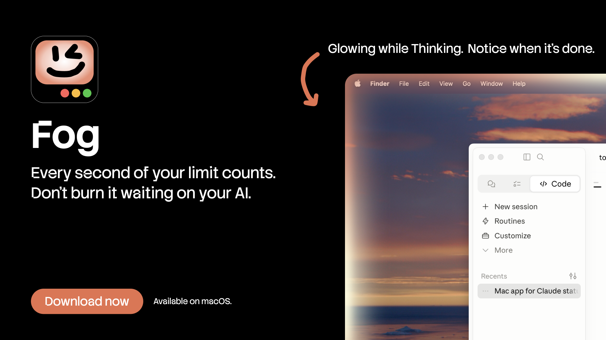
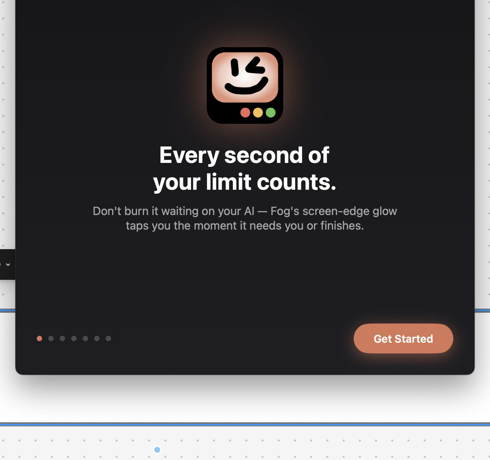
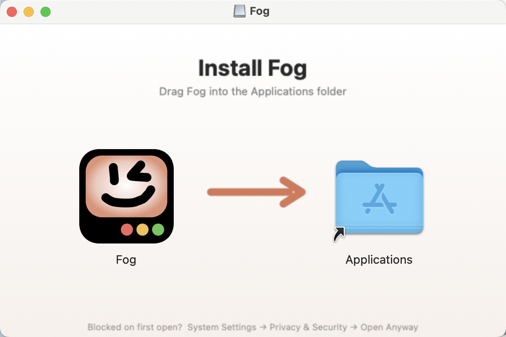

<p align="center">
  <a href="https://github.com/padakan/fog/releases/latest/download/Fog.dmg">
    
  </a>
</p>

<p align="center">
  <a href="https://github.com/padakan/fog/releases/latest/download/Fog.dmg"><b>↓ Download for macOS</b></a>
  &nbsp;·&nbsp; <a href="https://padakan.github.io/fog/">Website</a>
</p>

<p align="center">
  
  
</p>

---

A macOS ambient status indicator for **Claude Code** and other AI agents. It draws a
glowing **border around the edge of your screen** — opacity 100 hard against the edge,
fading to 0 about 16px inward — that animates depending on what your agent is doing.
Corners are left sharp so the macOS display mask clips them to the *real* screen-corner
radius (rounded on a MacBook, square on an external monitor).

The border is a transparent, click-through, always-on-top overlay — it never steals
focus or blocks anything underneath. The interactive bits (waiting dialog, done pill)
use a liquid-glass style.

## Behaviour per state

| State    | Border                                            | Extra |
|----------|---------------------------------------------------|-------|
| Thinking | selected color, waves of light travel around the edge (Siri-like) | — |
| Working  | same waves, running **2× faster**                 | — |
| Waiting  | shimmer **freezes** (held, "stopped thinking")    | glass dialog drops from the top with the question + answer buttons; fires a notification |
| Done     | a bright shine sweeps the screen bottom-left → bottom-right | then a glass "Done" pill with an **Open** button; auto-idles after ~12s |
| Idle     | hidden                                             | — |

## Colors / themes

Default is **Claude orange**. Click the menu-bar icon to open the color picker —
each theme is shown as a **colored circle**:

- **Solid** (single hue): Claude Orange · Sky · Violet · Emerald
- **Gradient** (brand palettes that travel around the border): Claude · Gemini · Codex · Cursor

Tap the dashed **+** to add your own color (solid = one color, gradient = two), up to
**8 total per category**. Custom swatches have an × to remove them. Your selection
and custom colors are remembered across launches.

## How it works

```
Claude Code  ──(hooks: SessionStart/UserPromptSubmit/PreToolUse/Notification/Stop)──▶
   hooks/claude-status-notify.sh  ──(HTTP POST 127.0.0.1:7842)──▶  Fog.app
```

Hooks fire on Claude Code lifecycle events, a small script maps each event to a
state and POSTs it to the app's local-only HTTP server (loopback, never exposed off
the machine). The app updates the border.

## Setup

```bash
# 1. Build the app (.app bundle so notifications work)
./build.sh

# 2. Launch it (and add to Login Items if you want it always on — see below)
open dist/Fog.app

# 3. Wire up Claude Code hooks (merges into ~/.claude/settings.json)
./install-hooks.sh
#    …or per-project:  ./install-hooks.sh /path/to/project
```

Restart any open Claude Code session so it picks up the new hooks. The next time
you send a prompt the border lights up.

### Other agents (Codex CLI · Gemini CLI · Cursor)

Fog is just a status sink — any agent with command-running hooks can drive it. See
[`adapters/`](adapters/README.md) for one-command installers:

```bash
cd adapters
./install-adapters.sh codex     # or: gemini / cursor
```

Native apps without a hook API (Claude desktop chat, Cowork, the Gemini app) can't be
driven cleanly — they'd need fragile Accessibility observation, which Fog doesn't do.

### Quick test (without Claude Code)

```bash
curl -s -X POST http://127.0.0.1:7842/status \
  -H 'Content-Type: application/json' \
  -d '{"state":"working","detail":"Edit main.swift"}'
```

States: `idle` · `thinking` · `working` · `waiting` · `done`.

Waiting with a clickable dialog:

```bash
curl -s -X POST http://127.0.0.1:7842/status \
  -H 'Content-Type: application/json' \
  -d '{"state":"waiting","question":"Run git push origin main?","options":["Yes","Yes, always","No"]}'
```

## Answering from the waiting dialog

The dialog can show answer buttons. Because Claude Code has no public channel to
inject a reply from another app, clicking an option is **best-effort**: it re-focuses
the terminal that was frontmost and types the option's number + Return into it. That
matches Claude Code's numbered permission prompts. This needs **Accessibility**
permission (System Settings → Privacy & Security → Accessibility → enable
ClaudeStatusBorder); the first attempt prompts for it. If you don't grant it, the
buttons just focus the terminal so you can answer there. The `Notification` hook only
carries a message, so by default the dialog shows the message with a **Go to Claude**
button — pass `options` yourself (as above) if you want clickable answers.

## First run & permissions

On first launch Fog shows a short onboarding (Welcome + an animated demo of the four
states → Permissions → Done). Re-open it anytime from the menu-bar popover → **Setup**.

| Permission | When | Required? | Without it |
|------------|------|-----------|------------|
| Gatekeeper (right-click → Open) | first launch | yes | app won't open |
| Notifications | onboarding | for waiting/done banners | sound + border still work |
| Screen Recording | onboarding (optional) | only the Done screen-shake | gloss + sound still play |
| Accessibility | onboarding (optional) | only typing an answer back | the button just focuses the terminal |

Mouse tracking, the localhost server, update checks, and focusing other apps need **no**
permission. Granting Screen Recording / Accessibility may need a relaunch to take effect.

## Updates (GitHub Releases)

Fog self-updates from GitHub Releases. On launch (and via **Check for updates** in the
popover) it asks `api.github.com` for the latest release, and if the tag is newer than
the bundled version it downloads the `.zip`, swaps itself, clears quarantine, and
relaunches.

**One-time setup** — point it at your repo (in `build.sh`):

```bash
UPDATE_REPO="${FOG_REPO:-OWNER/fog}"   # ← change OWNER/fog to your repo
```

**Cut a release:**

```bash
gh auth login                                   # once
FOG_REPO=youruser/fog ./release.sh 1.1          # builds, makes .dmg + .zip, publishes
```

`release.sh` builds at that version and attaches **two** assets to `v1.1`:
- `Fog-1.1.dmg` — what you send friends for a first install (drag-to-Applications).
- `Fog-1.1.zip` — what the in-app self-updater downloads.

(Or build a DMG on its own: `./dmg.sh 1.1`.)

**First install for a friend (important — Fog is ad-hoc signed, not notarized):**
Open the `.dmg`, drag **Fog** into Applications. First launch only: right-click
Fog.app → **Open** (macOS asks once for indie apps). If it still won't open:

```bash
xattr -dr com.apple.quarantine /Applications/Fog.app
```

After the first launch, in-app updates are friction-free (Fog strips quarantine on each
update itself). Keep it in `/Applications` (or `~/Applications`) so updates can replace
it in place.

> For zero-friction installs (no `xattr` step), you'd need a Developer ID certificate
> + notarization (Apple Developer, $99/yr) — see the "proper distribution" path.

## Auto-start at login

Either add `dist/Fog.app` under  System Settings → General →
Login Items, or install a LaunchAgent:

```bash
cat > ~/Library/LaunchAgents/com.padagot.fog.plist <<EOF
<?xml version="1.0" encoding="UTF-8"?>
<!DOCTYPE plist PUBLIC "-//Apple//DTD PLIST 1.0//EN" "http://www.apple.com/DTDs/PropertyList-1.0.dtd">
<plist version="1.0"><dict>
  <key>Label</key><string>com.padagot.fog</string>
  <key>ProgramArguments</key>
  <array><string>$(pwd)/dist/Fog.app/Contents/MacOS/ClaudeStatusBorder</string></array>
  <key>RunAtLoad</key><true/>
  <key>KeepAlive</key><true/>
</dict></plist>
EOF
launchctl load ~/Library/LaunchAgents/com.padagot.fog.plist
```

## Customizing

- **Border fade depth / shimmer speed / breathing** — `BorderView.swift`
  (`fadeDepth`, `animationSpeed`, the `draw`/`makeShading` functions).
- **Color templates** — `Theme.swift` (`Themes.solid` / `Themes.gradient`).
- **Done sweep look** — `DoneSweepView` in `BorderView.swift`.
- **Glass dialog / pill / buttons** — `InteractiveViews.swift`.
- **Event → state mapping & task labels** — `hooks/claude-status-notify.sh`.
- **Port** — change `kStatusPort` in `AppDelegate.swift` (and set
  `CLAUDE_STATUS_PORT` for the hook script to match).
- **When to notify** — currently only the `waiting` state notifies (the `Stop`/done
  hook fires every turn, so notifying there would be noisy). Toggle in the hook script.

> Note: this targets **macOS 15**, where Apple's real Liquid Glass API isn't
> available, so glass surfaces are approximated with `.ultraThinMaterial`.

## Files

```
Package.swift                         Swift package (executable)
Sources/ClaudeStatusBorder/
  main.swift                          bootstrap
  AppDelegate.swift                   lifecycle, server wiring, menu-bar theme switcher, notifications
  Theme.swift                         color modes + solid/gradient templates
  OverlayWindow.swift                 transparent click-through window (border + sweep)
  BorderView.swift                    the glowing edge border + Done sweep (SwiftUI/Canvas)
  InteractiveWindow.swift             mouse-accepting window: modal/pill + answer keystrokes
  InteractiveViews.swift              glass waiting dialog, done pill, glass buttons
  StatusModel.swift                   states, theme selection, idle/done timing
  StatusServer.swift                  tiny loopback HTTP server (Network framework)
hooks/claude-status-notify.sh         Claude Code hook -> app bridge
install-hooks.sh                      merge hooks into settings.json (idempotent)
settings.snippet.json                 reference hook config
build.sh                              build the .app bundle
```

Switch themes / quit from the menu-bar icon.
